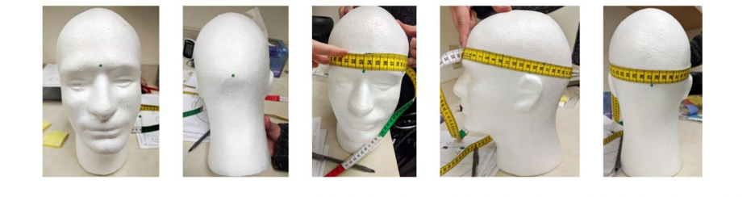

# TBI lab EEG protocol 

## Material 
- 1 plastic bin 
- 1 Emotiv Cap (54-56-58 sizes) 
- 1 amplifier  
- 1 bottle of saline  
- 1 towel 
- 1 glass cup 
- 2 gauzes 
- 34 felts  
- 1 measuring tape 
- 1 bottle of alcohol 
- 1 bottle of Nuprep 
- 1 Laptop w/ Emotiv Pro license already installed 

## Prior session procedures: 

Measure head diameter from nasion to inion. Always rounding down. *for example: if a head is 57cm use size 56cm cap .  

Report length and type of hair (ex: short & thin or long & thick, etc.): this information will help to pick the most convenient felts size   

Felts: thin hair 8 mm felts (short) if thicker hair 12 mm felts (long) 

Pre-soak the felts: Submerge felts in saline solution for about 10 minutes prior to the EEG session (make sure we have all 34 felts). 

Put the amplifier on the cap: 

56-58cm caps: amplifier in the back 

54cm cap: amplifier on the top 

 

(Black lining on top, DRL and CMS as reference). 

Take out the soaked felts and place them on a towel. Press very smoothly/light taps with the towel to remove excess of saline solution. We still want the felts to be damp 

Flip the cap and start placing the felts in each hole. This will take about 5-7 minutes. PLEASE DO NOT RUSH! Make sure every felt is in each hole correctly. 

 

Session procedures:  

Ask participant to take off any piercings or earrings. Explain EEG briefly and answer potential questions. 

Exfoliate skin with Nuprep on forehead and mastoid regions prior to placing cap on head. One gauze for each side of the head. ONLY wipe unidirectional, i.e., one way. DO NOT wipe back and forth. 

Put on the Emotiv cap on smoothly and center it (look at front 2 sensors (Fp1 & Fp2) to help guide you). After the cap is centered, you must measure it to make sure that it is. Using the centimeter side of the measuring tape, measure from the bridge of the nose (nasion) to the indent of the back of the head (anion). Electrode Cz should be in the middle of these two points. Next, measure from the middle of one ear to the other. Electrode holder Cz should again be in the middle of these two points. 

Have participant strap themselves in. Mention that “it should be tight, but not uncomfortable.” 

Turn amplifier on (button on the bottom of it). The light should turn on.   

 

 
The amplifier USB should be plugged in. 

 

Access laptop (Mark’s account, password/pin: 11110) 

Open EmotivPRO app (username: 524yt5; password: Morris2024) 

   

Connect headset (red circle on the top of the screen) and connect.  

Control Box position: Assign where the amplifier is (back or top).  

Contact Quality: Start adding the solution in each electrode, use the squirt solution bottle. Always start with the 2 reference electrodes (black sensors labeled DRL & CMS). Both must be green. Move electrodes back and forth (shimmy) to improve contact. Must be 100% 

EEG quality: This is not as important as contact quality but is still necessary. Add saline/shimmy any other sensors that repeatedly show RED or GREY. Need to get 100% at least once. 

 

Electrodes Setup: Just click APPLY 

Show the participant the laptop screen and have them clinch their jaw & blink their eyes really quick. This is to give them visual feedback to decrease the artifacts generated by their movements such as blinking or activating face muscles.  

10 minutes resting EEG: Say these instructions: “a cross will appear in the middle of the screen. You will look at that for the next 5 minutes. The following 5 minutes we will do closed eyes, during those minutes you must not fall sleep. Try to be as relaxed as you can be. As if you're at a park bench on a nice summer day.” Afterwards, dim the light and close the door. 

Once in the next-door room, open PDF fixation cross, plug in USB, send the PDF cross to the extended screen and press CONTROL + L to make the PDF full screen. 

Go back to participant room to make sure the fixation cross is full screen. Remind participant to be as relaxed and still as possible. Then go back to the next-door room to record. 

Start recording clicking on red dot on the bottom left of the screen 

Recording name: EO / EC 

Subject Name: Roybal_** 

 

Export data (motion, markers, demographics, EDF) 

 

Go to /Documents 

Add new files in /Roybal/New_participant (4 files or EC/4 files for EC) 

Copy folder in the cluster 

CLEANING 

1 plastic bucket 

1 glass jar 

1 plastic baggie 

1 clip 

Baby shampoo 

Distilled water 

Procedures 

We cannot allow the wires and amplifier to get wet, so the baggie will cover the wires, close it and bend it, and put the clip towards the end. 

 

Take out the amplifier and charge it after each session.  

Next, invert the cap and take out all the felts and put them in the glass jar. Don’t squeeze too hard on the felts, they break easily.  

Take baby shampoo and put 3 squeezes in the bucket and 1 and half in the felts jar. Grab distilled water underneath the shelf and pour over top the felts and shake a round with finger to spread up the shampoo. Same procedure in bucket with cap inside. Enough submerged to wet everything and clean it, push it back and forth a couple of times. Always the wires outside.  

Keep both cap and felts ~10 minutes soaked.  

 

After 10 minutes, you rinse it three times, rinse also felts.  

Hang the cap from two sides and clip the wires on the top (to prevent the water to drips down).  

 

Rinse the felts, use paper towels to dry them tapping them gently.  Put them back on the drawer in their own basket to dry out.  